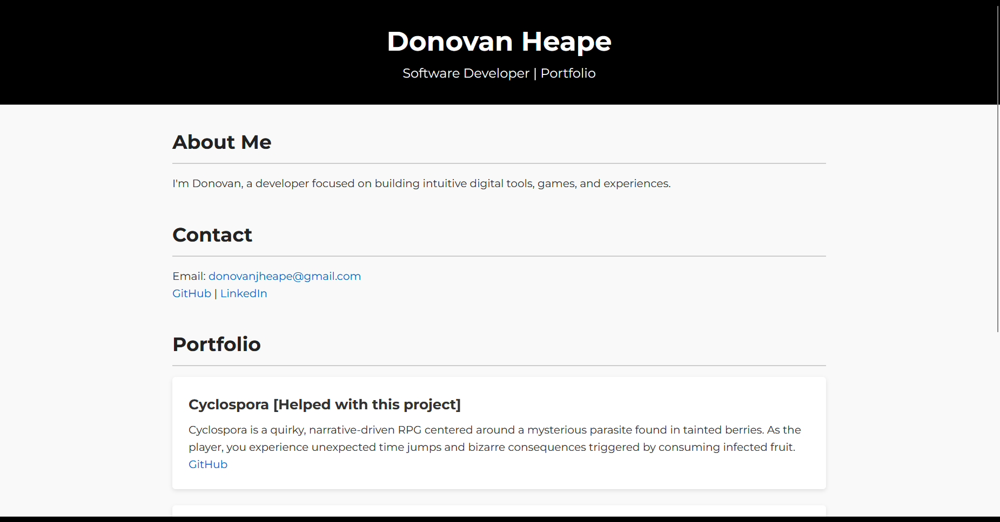

# SudoSavvy.github.io

Welcome to my personal portfolio website, showcasing my projects, skills, and professional journey as a software engineer.

## About This Project

This is the source code powering my online portfolio at [SudoSavvy.github.io](https://sudosavvy.github.io). It is built with modern web technologies to provide a sleek, responsive, and accessible experience for visitors and potential employers.

### Development Story

I designed and developed this site to serve as a centralized hub to display my coding projects, resume, and contact info. The key focus was on clean UI/UX and easy maintainability. I built this from scratch and continuously update it as I grow my portfolio.

### Features

- Project galleries with GitHub links
- Contact form integrated with email forwarding
- Smooth scrolling and interactive navigation

### Challenges

Balancing a minimal yet informative design was tricky, and having to fight my code on breaking one thing when i fixed another.

## About Me

Hi, I’m Donovan Heape, a passionate Software Engineer focused on machine learning and web development. You can find me on:

- [LinkedIn](https://www.linkedin.com/in/donovan-heape/)
- [Portfolio](https://sudosavvy.github.io)

Feel free to explore my projects and reach out!

---

## Screenshot

<<<<<<< HEAD
  <!-- Replace with actual screenshot file -->
=======
  <!-- Replace with actual screenshot file -->
>>>>>>> 48f54d68fd98645810eeb3c881eab310f811e74a
